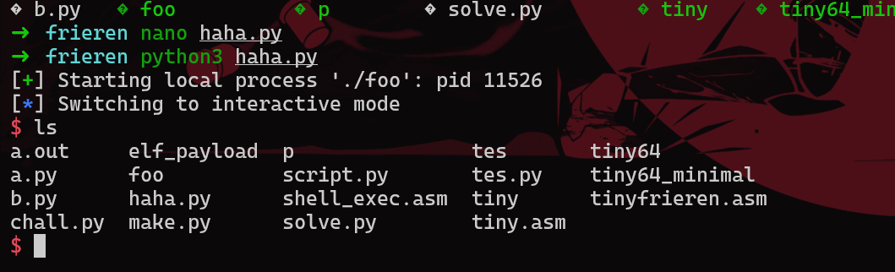

# Frieren


## Executive Summary

diberikan sebuah service python yang hanya menerima binary yang headernya harus ELF dan length nya harus 76 atau dibawahnya

berikut chall.py nya :

```py
#!/usr/bin/python3
import subprocess
import os
import base64

frieren = b"\x7fELF"

fd = os.memfd_create("sylphiette", 0)
sylphiette = base64.b64decode(input("sylphiette vs frieren cantikan mana? ").strip())

assert len(sylphiette) <= 76, "kegedean"
assert frieren == sylphiette[:4], "harus elf yang cantik" # frieren = b"\x7fELF"

with os.fdopen(fd, "wb", closefd=False) as f:
    f.write(sylphiette)

try:
    p = subprocess.Popen([f"/proc/{os.getpid()}/fd/{fd}"], shell=False)
    p.wait()
except:
    os.killpg(os.getpid(), 9)
    exit(1)
```

## Technical Report

pada saat itu saya mencoba belajar membuat tiny elf dari website [tiny elf][1] tetapi karena kehabisan waktu saya memutuskan untuk memakai binary golfing yang saya temukan pada suatu [event ctftime][2]

jadi idenya adalah membuat binary yang menerima input yang besar dan menjalankan inputannya

jadi saat binary meminta input kita masukkan sehllcode yang spawn shell. Jadi itu namanya golfing, alih alih membuat binary yang spawn shell langsung kita malah membuat place holder agar kita dapat memasukkan shellcode ke 2 kita

dan didapatkan lah shell nya :




## conclusion

Jika tidak dapat langsung spawn shell dengan binary yang sangat kecil maka coba golfing dulu

## Refrence

- [tiny elf][1]
- [binary golfing][2]

[1]: https://www.muppetlabs.com/~breadbox/software/tiny/teensy.html
[2]: https://ctftime.org/writeup/38694