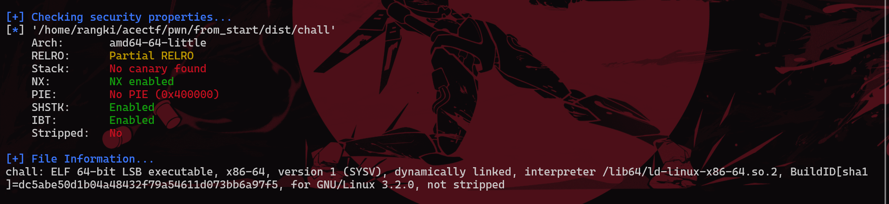
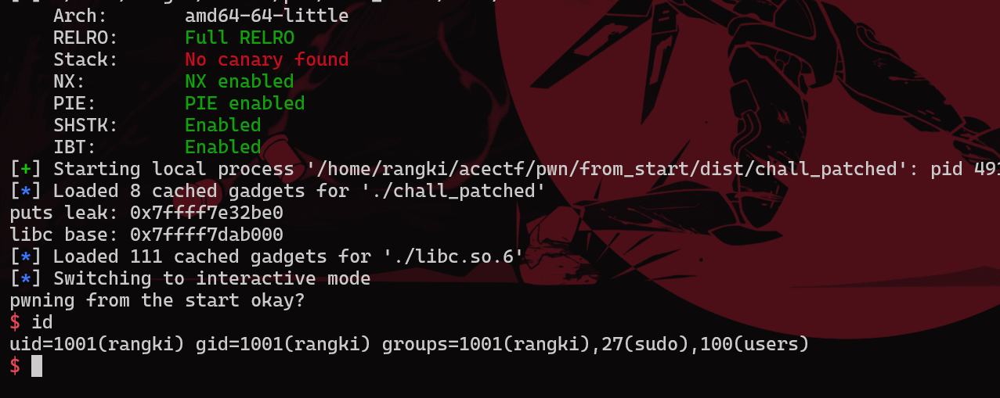

# From The Start


## Executive Summary
diberikan sebuah attachment yang berisikan source code, libc dan docker file

berikut source code nya :

```c
#include <stdio.h>

__attribute__((constructor)) void init(){
    setbuf(stdin, NULL);
    setbuf(stdout, NULL);
}

__attribute__((naked)) void helper(){
    __asm__(
        "pop %rdi\nret\n"
        "pop %rsi\nret\n"
        "pop %rdx\nret\n"
    );
}

int main(){
    init();
    char mem[0x100];
    puts("pwning from the start okay?");
    gets(mem);
    return 0;
}
```

## Technical Report

pada source code, terlihat kita diberikan 3 kendali parameter gadget (rdi,rsi,rdx) dan program ini menggunakan fungsi gets() untuk mengambil input yang dimana sangat tidak disarankan karena dapat mengakibatkan BOF dan kita bisa kendalikan binary.



proteksi binary nya juga lemah, hanya no execute stack yang aktif dan juga binary tidak stripped dan dynamically linked (kemungkinan ada fungsi win())

karena tidak ada fungsi win() kita akan leak libc menggunakan ret2plt dan menggunakan leak libc yang di kurangkan offset nya untuk melakukan ret2libc



## Conclusion
jangan pernah gunakan fungsi gets, dan pastikan proteksi binary selalu aktif semua

## Refrence

[ret2plt and ret2libc tech][1]

[1]: https://ir0nstone.gitbook.io/notes/binexp/stack/aslr/ret2plt-aslr-bypass